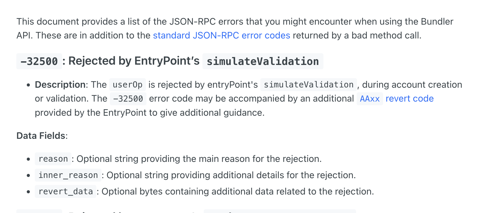
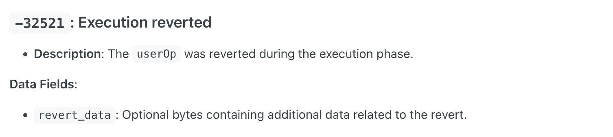

curl 'https://api10-fat.pulse.social/pulse-chain/optimism' \
  -H 'accept: */*' \
  -H 'accept-language: zh-CN,zh;q=0.9,en;q=0.8' \
  -H 'cache-control: no-cache' \
  -H 'content-type: application/json' \
  -H 'origin: https://fat.pulse.social' \
  -H 'pragma: no-cache' \
  -H 'priority: u=1, i' \
  -H 'referer: https://fat.pulse.social/' \
  -H 'sec-ch-ua: "Google Chrome";v="131", "Chromium";v="131", "Not_A Brand";v="24"' \
  -H 'sec-ch-ua-mobile: ?0' \
  -H 'sec-ch-ua-platform: "macOS"' \
  -H 'sec-fetch-dest: empty' \
  -H 'sec-fetch-mode: cors' \
  -H 'sec-fetch-site: same-site' \
  -H 'user-agent: Mozilla/5.0 (Macintosh; Intel Mac OS X 10_15_7) AppleWebKit/537.36 (KHTML, like Gecko) Chrome/131.0.0.0 Safari/537.36' \
  --data-raw '{"jsonrpc":"2.0","id":3,"method":"eth_estimateUserOperationGas","params":[{"callData":"0x34fcd5be00000000000000000000000000000000000000000000000000000000000000200000000000000000000000000000000000000000000000000000000000000002000000000000000000000000000000000000000000000000000000000000004000000000000000000000000000000000000000000000000000000000000001200000000000000000000000004200000000000000000000000000000000000042000000000000000000000000000000000000000000000000000000000000000000000000000000000000000000000000000000000000000000000000000000600000000000000000000000000000000000000000000000000000000000000044095ea7b30000000000000000000000001231deb6f5749ef6ce6943a275a1d3e7486f4eae00000000000000000000000000000000000000000000000007e9e499c7a4dbe8000000000000000000000000000000000000000000000000000000000000000000000000000000001231deb6f5749ef6ce6943a275a1d3e7486f4eae00000000000000000000000000000000000000000000000000000fda40b2e0e800000000000000000000000000000000000000000000000000000000000000600000000000000000000000000000000000000000000000000000000000000a04a6010a660000000000000000000000000000000000000000000000000000000000000060000000000000000000000000000000000000000000000000000000000000022000000000000000000000000000000000000000000000000000000000000004c081ec39941c1c9fa8790786b4bac4e9213761951fa11ee04233bb0eec2b028a540000000000000000000000000000000000000000000000000000000000000140000000000000000000000000000000000000000000000000000000000000018000000000000000000000000000000000000000000000000000000000000000000000000000000000000000000b2c639c533813f4aa9d7837caf62653d097ff85000000000000000000000000005cb1e18f7ca2cd66bd3c9f290876c0f1cc5ad20000000000000000000000000000000000000000000000000000000000128c5a000000000000000000000000000000000000000000000000000000000000210500000000000000000000000000000000000000000000000000000000000000010000000000000000000000000000000000000000000000000000000000000001000000000000000000000000000000000000000000000000000000000000000a737461726761746556320000000000000000000000000000000000000000000000000000000000000000000000000000000000000000000000000000000000086c6966692d617069000000000000000000000000000000000000000000000000000000000000000000000000000000000000000000000000000000000000000100000000000000000000000000000000000000000000000000000000000000200000000000000000000000006140b987d6b51fd75b66c3b07733beb5167c42fc0000000000000000000000006140b987d6b51fd75b66c3b07733beb5167c42fc00000000000000000000000042000000000000000000000000000000000000420000000000000000000000000b2c639c533813f4aa9d7837caf62653d097ff8500000000000000000000000000000000000000000000000007e9e499c7a4dbe800000000000000000000000000000000000000000000000000000000000000e0000000000000000000000000000000000000000000000000000000000000000100000000000000000000000000000000000000000000000000000000000001442646478b000000000000000000000000420000000000000000000000000000000000004200000000000000000000000000000000000000000000000007e9e499c7a4dbe80000000000000000000000000b2c639c533813f4aa9d7837caf62653d097ff850000000000000000000000000000000000000000000000000000000000128c5a0000000000000000000000001231deb6f5749ef6ce6943a275a1d3e7486f4eae00000000000000000000000000000000000000000000000000000000000000c0000000000000000000000000000000000000000000000000000000000000004202420000000000000000000000000000000000004201ffff01bce00644e5535b68daf73d1528e8b08e6a14472c001231deb6f5749ef6ce6943a275a1d3e7486f4eae00000000000000000000000000000000000000000000000000000000000000000000000000000000000000000000000000000000000000000000000000000000000000000000000000000000000000000000000000000000000100000000000000000000000000000000000000000000000000000000000000a000000000000000000000000000000000000000000000000000000fda40b2e0e80000000000000000000000000000000000000000000000000000000000000000000000000000000000000000005cb1e18f7ca2cd66bd3c9f290876c0f1cc5ad200000000000000000000000000000000000000000000000000000000000075e80000000000000000000000001493e7b8d4dfade0a178dad9335470337a3a219a0000000000000000000000000000000000000000000000000000000000128c5a000000000000000000000000000000000000000000000000000000000000000000000000000000000000000000000000000000000000000000000000000000e000000000000000000000000000000000000000000000000000000000000001400000000000000000000000000000000000000000000000000000000000000480000000000000000000000000000000000000000000000000000000000000002c0003010013030000000000000000000000000000000ddae0010011010000000000000000000000000001f3b80000000000000000000000000000000000000000000000000000000000000000000000000000000000000000000000000000032081ec39941c1c9fa8790786b4bac4e9213761951fa11ee04233bb0eec2b028a540000000000000000000000000000000000000000000000000000000000000060000000000000000000000000005cb1e18f7ca2cd66bd3c9f290876c0f1cc5ad2000000000000000000000000000000000000000000000000000000000000000100000000000000000000000000000000000000000000000000000000000000200000000000000000000000006140b987d6b51fd75b66c3b07733beb5167c42fc0000000000000000000000006140b987d6b51fd75b66c3b07733beb5167c42fc000000000000000000000000833589fcd6edb6e08f4c7c32d4f71b54bda029130000000000000000000000000000000000000000000000000000000000000000000000000000000000000000000000000000000000000000000000000012747d00000000000000000000000000000000000000000000000000000000000000e0000000000000000000000000000000000000000000000000000000000000000100000000000000000000000000000000000000000000000000000000000001642646478b000000000000000000000000833589fcd6edb6e08f4c7c32d4f71b54bda02913000000000000000000000000000000000000000000000000000000000012747d000000000000000000000000eeeeeeeeeeeeeeeeeeeeeeeeeeeeeeeeeeeeeeee000000000000000000000000000000000000000000000000000129ac164e42ba0000000000000000000000004dac9d1769b9b304cb04741dcdeb2fc14abdf11000000000000000000000000000000000000000000000000000000000000000c0000000000000000000000000000000000000000000000000000000000000007002833589fcd6edb6e08f4c7c32d4f71b54bda0291301ffff01b4cb800910b228ed3d0834cf79d697127bbb00e5006140b987d6b51fd75b66c3b07733beb5167c42fc01420000000000000000000000000000000000000601ffff02004dac9d1769b9b304cb04741dcdeb2fc14abdf1100000000000000000000000000000000000000000000000000000000000000000000000000000000000000000000000000000000000000000000000000000000000000000000000000000000000000000000000000000000000000000000000000000000000000000","callGasLimit":"0x0","initCode":"0x","maxFeePerGas":"0x1113d8","maxPriorityFeePerGas":"0x1e848","nonce":"0xd","paymasterAndData":"0x","preVerificationGas":"0x0","sender":"0x005CB1e18f7cA2Cd66bD3C9F290876c0F1cc5AD2","signature":"0x0000000000000000000000000000000000000000000000000000000000000020000000000000000000000000000000000000000000000000000000000000000000000000000000000000000000000000000000000000000000000000000000400000000000000000000000000000000000000000000000000000000000000200000000000000000000000000000000000000000000000000000000000000002000000000000000000000000000000000000000000000000000000000000000c0000000000000000000000000000000000000000000000000000000000000012000000000000000000000000000000000000000000000000000000000000000170000000000000000000000000000000000000000000000000000000000000001949fc7c88032b9fcb5f6efc7a7b8c63668eae9871b765e23123bb473ff57aa831a7c0d9276168ebcc29f2875a0239cffdf2a9cd1c2007c5c77c071db9264df1d000000000000000000000000000000000000000000000000000000000000002549960de5880e8c687434170f6476605b8fe4aeb9a28632c7995cf3ba831d97630500000000000000000000000000000000000000000000000000000000000000000000000000000000000000000000000000000000000000000000000000008a7b2274797065223a22776562617574686e2e676574222c226368616c6c656e6765223a2273496a396e6164474850596759334b7156384f7a4a666c726275504b474f716d59576f4d57516869467773222c226f726967696e223a2268747470733a2f2f7369676e2e636f696e626173652e636f6d222c2263726f73734f726967696e223a66616c73657d00000000000000000000000000000000000000000000","verificationGasLimit":"0xc3500"},"0x5FF137D4b0FDCD49DcA30c7CF57E578a026d2789"]}'


  curl 'https://api10-fat.pulse.social/pulse-chain/optimism' \
  -H 'accept: */*' \
  -H 'accept-language: zh-CN,zh;q=0.9,en;q=0.8' \
  -H 'cache-control: no-cache' \
  -H 'content-type: application/json' \
  -H 'origin: https://fat.pulse.social' \
  -H 'pragma: no-cache' \
  -H 'priority: u=1, i' \
  -H 'referer: https://fat.pulse.social/' \
  -H 'sec-ch-ua: "Google Chrome";v="131", "Chromium";v="131", "Not_A Brand";v="24"' \
  -H 'sec-ch-ua-mobile: ?0' \
  -H 'sec-ch-ua-platform: "macOS"' \
  -H 'sec-fetch-dest: empty' \
  -H 'sec-fetch-mode: cors' \
  -H 'sec-fetch-site: same-site' \
  -H 'user-agent: Mozilla/5.0 (Macintosh; Intel Mac OS X 10_15_7) AppleWebKit/537.36 (KHTML, like Gecko) Chrome/131.0.0.0 Safari/537.36' \
  --data-raw '{"jsonrpc":"2.0","id":3,"method":"eth_estimateUserOperationGas","params":[{"callData":"0x34fcd5be00000000000000000000000000000000000000000000000000000000000000200000000000000000000000000000000000000000000000000000000000000002000000000000000000000000000000000000000000000000000000000000004000000000000000000000000000000000000000000000000000000000000001200000000000000000000000004200000000000000000000000000000000000042000000000000000000000000000000000000000000000000000000000000000000000000000000000000000000000000000000000000000000000000000000600000000000000000000000000000000000000000000000000000000000000044095ea7b30000000000000000000000001231deb6f5749ef6ce6943a275a1d3e7486f4eae00000000000000000000000000000000000000000000000007e9e499c7a4dbe8000000000000000000000000000000000000000000000000000000000000000000000000000000001231deb6f5749ef6ce6943a275a1d3e7486f4eae00000000000000000000000000000000000000000000000000000fda40b2e0e800000000000000000000000000000000000000000000000000000000000000600000000000000000000000000000000000000000000000000000000000000a04a6010a660000000000000000000000000000000000000000000000000000000000000060000000000000000000000000000000000000000000000000000000000000022000000000000000000000000000000000000000000000000000000000000004c081ec39941c1c9fa8790786b4bac4e9213761951fa11ee04233bb0eec2b028a540000000000000000000000000000000000000000000000000000000000000140000000000000000000000000000000000000000000000000000000000000018000000000000000000000000000000000000000000000000000000000000000000000000000000000000000000b2c639c533813f4aa9d7837caf62653d097ff85000000000000000000000000005cb1e18f7ca2cd66bd3c9f290876c0f1cc5ad20000000000000000000000000000000000000000000000000000000000128c5a000000000000000000000000000000000000000000000000000000000000210500000000000000000000000000000000000000000000000000000000000000010000000000000000000000000000000000000000000000000000000000000001000000000000000000000000000000000000000000000000000000000000000a737461726761746556320000000000000000000000000000000000000000000000000000000000000000000000000000000000000000000000000000000000086c6966692d617069000000000000000000000000000000000000000000000000000000000000000000000000000000000000000000000000000000000000000100000000000000000000000000000000000000000000000000000000000000200000000000000000000000006140b987d6b51fd75b66c3b07733beb5167c42fc0000000000000000000000006140b987d6b51fd75b66c3b07733beb5167c42fc00000000000000000000000042000000000000000000000000000000000000420000000000000000000000000b2c639c533813f4aa9d7837caf62653d097ff8500000000000000000000000000000000000000000000000007e9e499c7a4dbe800000000000000000000000000000000000000000000000000000000000000e0000000000000000000000000000000000000000000000000000000000000000100000000000000000000000000000000000000000000000000000000000001442646478b000000000000000000000000420000000000000000000000000000000000004200000000000000000000000000000000000000000000000007e9e499c7a4dbe80000000000000000000000000b2c639c533813f4aa9d7837caf62653d097ff850000000000000000000000000000000000000000000000000000000000128c5a0000000000000000000000001231deb6f5749ef6ce6943a275a1d3e7486f4eae00000000000000000000000000000000000000000000000000000000000000c0000000000000000000000000000000000000000000000000000000000000004202420000000000000000000000000000000000004201ffff01bce00644e5535b68daf73d1528e8b08e6a14472c001231deb6f5749ef6ce6943a275a1d3e7486f4eae00000000000000000000000000000000000000000000000000000000000000000000000000000000000000000000000000000000000000000000000000000000000000000000000000000000000000000000000000000000000100000000000000000000000000000000000000000000000000000000000000a000000000000000000000000000000000000000000000000000000fda40b2e0e80000000000000000000000000000000000000000000000000000000000000000000000000000000000000000005cb1e18f7ca2cd66bd3c9f290876c0f1cc5ad200000000000000000000000000000000000000000000000000000000000075e80000000000000000000000001493e7b8d4dfade0a178dad9335470337a3a219a0000000000000000000000000000000000000000000000000000000000128c5a000000000000000000000000000000000000000000000000000000000000000000000000000000000000000000000000000000000000000000000000000000e000000000000000000000000000000000000000000000000000000000000001400000000000000000000000000000000000000000000000000000000000000480000000000000000000000000000000000000000000000000000000000000002c0003010013030000000000000000000000000000000ddae0010011010000000000000000000000000001f3b80000000000000000000000000000000000000000000000000000000000000000000000000000000000000000000000000000032081ec39941c1c9fa8790786b4bac4e9213761951fa11ee04233bb0eec2b028a540000000000000000000000000000000000000000000000000000000000000060000000000000000000000000005cb1e18f7ca2cd66bd3c9f290876c0f1cc5ad2000000000000000000000000000000000000000000000000000000000000000100000000000000000000000000000000000000000000000000000000000000200000000000000000000000006140b987d6b51fd75b66c3b07733beb5167c42fc0000000000000000000000006140b987d6b51fd75b66c3b07733beb5167c42fc000000000000000000000000833589fcd6edb6e08f4c7c32d4f71b54bda029130000000000000000000000000000000000000000000000000000000000000000000000000000000000000000000000000000000000000000000000000012747d00000000000000000000000000000000000000000000000000000000000000e0000000000000000000000000000000000000000000000000000000000000000100000000000000000000000000000000000000000000000000000000000001642646478b000000000000000000000000833589fcd6edb6e08f4c7c32d4f71b54bda02913000000000000000000000000000000000000000000000000000000000012747d000000000000000000000000eeeeeeeeeeeeeeeeeeeeeeeeeeeeeeeeeeeeeeee000000000000000000000000000000000000000000000000000129ac164e42ba0000000000000000000000004dac9d1769b9b304cb04741dcdeb2fc14abdf11000000000000000000000000000000000000000000000000000000000000000c0000000000000000000000000000000000000000000000000000000000000007002833589fcd6edb6e08f4c7c32d4f71b54bda0291301ffff01b4cb800910b228ed3d0834cf79d697127bbb00e5006140b987d6b51fd75b66c3b07733beb5167c42fc01420000000000000000000000000000000000000601ffff02004dac9d1769b9b304cb04741dcdeb2fc14abdf1100000000000000000000000000000000000000000000000000000000000000000000000000000000000000000000000000000000000000000000000000000000000000000000000000000000000000000000000000000000000000000000000000000000000000000","callGasLimit":"0x0","initCode":"0x","maxFeePerGas":"0x1113d8","maxPriorityFeePerGas":"0x1e848","nonce":"0x1","paymasterAndData":"0x","preVerificationGas":"0x0","sender":"0x005CB1e18f7cA2Cd66bD3C9F290876c0F1cc5AD2","signature":"0x0000000000000000000000000000000000000000000000000000000000000020000000000000000000000000000000000000000000000000000000000000000000000000000000000000000000000000000000000000000000000000000000400000000000000000000000000000000000000000000000000000000000000200000000000000000000000000000000000000000000000000000000000000002000000000000000000000000000000000000000000000000000000000000000c0000000000000000000000000000000000000000000000000000000000000012000000000000000000000000000000000000000000000000000000000000000170000000000000000000000000000000000000000000000000000000000000001949fc7c88032b9fcb5f6efc7a7b8c63668eae9871b765e23123bb473ff57aa831a7c0d9276168ebcc29f2875a0239cffdf2a9cd1c2007c5c77c071db9264df1d000000000000000000000000000000000000000000000000000000000000002549960de5880e8c687434170f6476605b8fe4aeb9a28632c7995cf3ba831d97630500000000000000000000000000000000000000000000000000000000000000000000000000000000000000000000000000000000000000000000000000008a7b2274797065223a22776562617574686e2e676574222c226368616c6c656e6765223a2273496a396e6164474850596759334b7156384f7a4a666c726275504b474f716d59576f4d57516869467773222c226f726967696e223a2268747470733a2f2f7369676e2e636f696e626173652e636f6d222c2263726f73734f726967696e223a66616c73657d00000000000000000000000000000000000000000000","verificationGasLimit":"0xc3500"},"0x5FF137D4b0FDCD49DcA30c7CF57E578a026d2789"]}'


## -32500
```json
{
  "jsonrpc": "2.0",
  "id": 3,
  "error": {
      "code": -32500,
      "message": "validation reverted: [reason]: AA25 invalid account nonce",
      "data": {
          "reason": "AA25 invalid account nonce"
      }
  }
}
```


https://docs.alchemy.com/reference/bundler-api-errors#-32500-rejected-by-entrypoints-simulatevalidation


(在bundler服务返回的地方处理？)

## -32521 
```json
{
    "jsonrpc": "2.0",
    "id": 3,
    "error": {
        "code": -32521,
        "message": "execution reverted",
        "data": {
            "revertData": "0xcf47918100000000000000000000000000000000000000000000000007e9e499c7a4dbe800000000000000000000000000000000000000000000000007e9e499c7a4dbe1"
        }
    }
}
```


```json
{
    "jsonrpc": "2.0",
    "id": 459,
    "error": {
        "code": -32521,
        "message": "execution reverted",
        "data": {
            "revertData": "0x"
        }
    }
}
```


